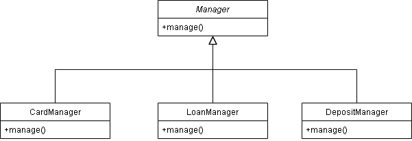
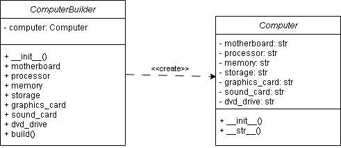

# MIKS

## Factory Method

## Builder

## Information
<table style="width: 100%;" border="1">
    <tbody>
        <tr>
            <td style="width: 50%;">Variant </td>
            <td style="width: 50%;">14 </td>
        </tr>
        <tr>
            <td style="width: 50%;">IDE </td>
            <td style="width: 50%;">VSCodium </td>
        </tr>
        <tr>
            <td style="width: 50%;">Language </td>
            <td style="width: 50%;">Python </td>
        </tr>
        <tr>
            <td style="width: 50%;">Database </td>
            <td style="width: 50%;">Microsoft SQL Server </td>
        </tr>
    </tbody>
</table>
